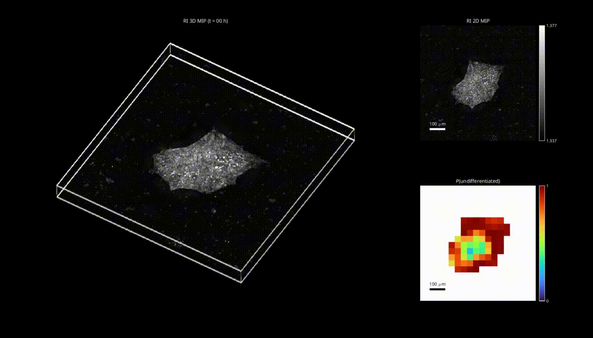

# DeepHOPE (deep-learning-assisted holotomography for pluripotency evaluation)
This repository contains codes, models, and data for demonstrating DeepHOPE, which is an integrated pipeline of holotmographic imaging and deep-learning image recognition for assessing the stemness of an hPSC colony. 

## Demo config, model and data
Config: [google drive link](https://drive.google.com/drive/folders/1Wb3pn2wLnlkKAOuaRPOMSqsdJi6oDVvZ?usp=sharing)
Pre-trained model (trained using the cofing file args_train.yaml) : [google drive link](https://drive.google.com/drive/folders/1KDaMQe6ZQ3eN0REY7Q4fb-ijQ0S5MHzd?usp=sharing)   
Example data (iPSC colonies for inference): [google drive link](https://drive.google.com/drive/folders/1JV4vVBrRpGPSXsaQavx2FNHvBRPUVu8k?usp=sharing)   
Example yaml (won't work; just see for the format): [google drive link](https://drive.google.com/drive/folders/1MH0YmaA8YaoTEM29SHzHMIRif8boWSr3?usp=sharing)   

## Environment
```shell
conda env create -f environment.yml
```

```shell
conda activate env_DeepHOPE
``` 

## Data directory example
One can explicitely use the directory structure below or use yaml files (i.e., data_train.yaml, data_val.yaml, data_test.yaml; example is provided) that contain the file paths and classes
```shell

train               
 ├──  group1     
 |      ├── colony01_patch01.h5     
 |      ├── colony01_patch02.h5     
 |      ├── ...
 └──  group2     
 |      ├── colony01_patch01.h5     
 |      ├── colony01_patch02.h5     
 |      ├── ...
 ├── ...

val              
 ├──  group1     
 |      ├── colony01_patch01.h5     
 |      ├── colony01_patch02.h5     
 |      ├── ...
 └──  group2     
 |      ├── colony01_patch01.h5     
 |      ├── colony01_patch02.h5     
 |      ├── ...
 ├── ...

test               
 ├──  group1     
 |      ├── colony01_patch01.h5     
 |      ├── colony01_patch02.h5     
 |      ├── ...
 └──  group2     
 |      ├── colony01_patch01.h5     
 |      ├── colony01_patch02.h5     
 |      ├── ...
 ├── ...

```

## Training the neural network

```shell

python3 train.py --config "path to your config file"

```

## Inference with the trained neural network

```shell

python3 infer.py --config "path to your config file"

```


## Editting the config file
A config file is a yaml file of the following format, that governs the process of either training (train.py) or inference (infer.py).  
``` shell

# Computation
compute:
  gpus: "0"
  cpus: 4
# Computation
compute:
  gpus: "5"
  cpus: 2

# Optimizer
optim:
  loss: "CE"
  batch_size: 2
  epoch: 200
  optimizer_type: "SGD"
  learning_rate: 0.0001
  weight_decay: 0.01
  momentum: 0.9
  verbose: False
  scheduler_type: "CosineAnnealingLR"

# Model
model:
  type: "mresnet" #
  ch_in: 16
  num_classes: 2
  dir_ckpt: "/ckpts/mresnetpg34_ft128x2_gap_bottleneck_bam/"
  fname_ckpt: "epoch[00181]_tr[0.970]_va[0.953]_te[0.941]_trW[0.973]_vaW[0.937]_teW[0.934].pth.tar"
  aug_arch:
    ch_ft: 128
    growth_rate: 2
    block: "Bottleneck"
    layers: [3,4,6,3]
    att_type: "BAM"
    gap: False

# Dataset
data:
  dir_data: "/workspace03/gkim/stem_cell_jwshin/data/24_c0512_p0512_SEC1H5_wider_v4_testICCall_RS/"
  dir_infer: "/data03/gkim/stem_cell_jwshin/outs/24_SEC1H5_patch_v4_allh_GMGL13_keep1_resnetp34bam_bin_lossbal/infer"
  size_xy: 512
  size_z: 12
  reset_class: False

```
gpus: the id of GPU devices to use to compute deep neural networks and related gradients  
cpus: the number of CPU workers for DataLoaders.  

loss: string patterns that indicate which type of classification loss to utilize  
batch_size: number of patch data to perform each inference or gradient calculation   
epoch: number of iterations over the entire dataset, which the training proceeds until  
optimizer_type: type of gradient-based neural network parameter optimizer  
scheduler_type: type of learning rate schedulers for the optimizer  

ch_in: number of input channels (number of used vertical stacks in our case)  
dir_ckpt: the directory where neural network checkpoints, including the network parameters, will be saved  
fname_ckpt: the name of checkpoint file to load, when inferring or resuming training  
ch_ft: number of feature map channels after the initial convolution  
growth_rate: ratio of feature map increase between neighboring ResNet stages  
block: ResNet block structure - "Bottleneck"   
layers: a list containing the block counts of four ResNet stages  
att_type: type of attention mechanism - "BAM", "CBAM", "SA" available & not applied if not specified  
gap: boolean for using global average pooling   


dir_data: the directory that contains train, val, or test data (each file is a 3D HT patch)   
dir_infer: the directory to save the inference result  
size_xy: horizontal patch size (number of pixels)  
size_z: vertical patch size (number of pixels)  
reset_class: boolean for resetting the class annotation (true required for most inference)  
  
## License
This project is open-sourced under the MIT license.
